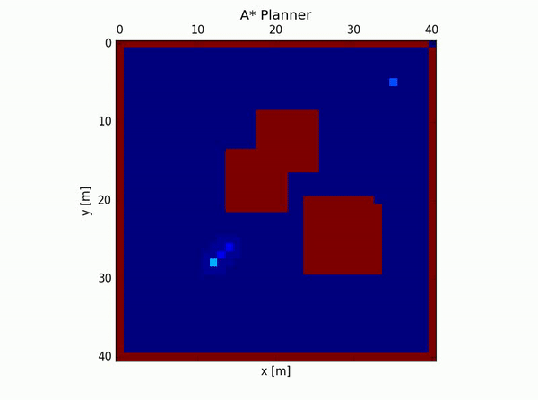
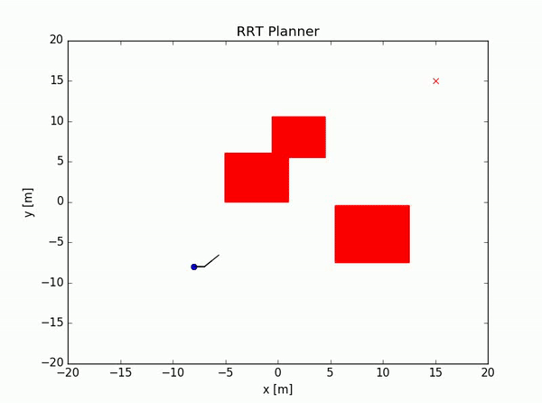
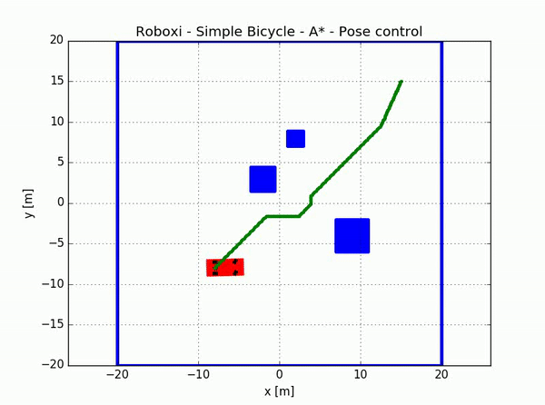
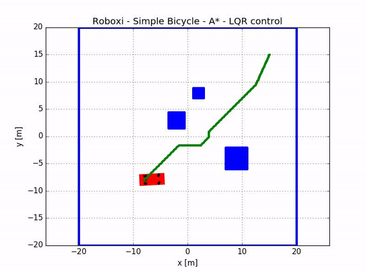
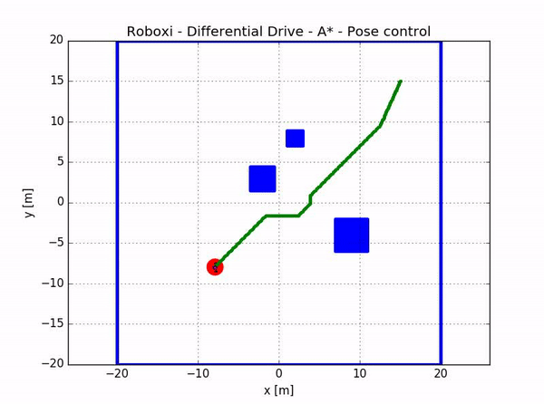
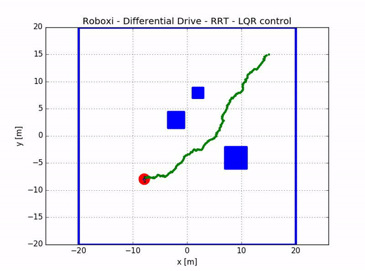
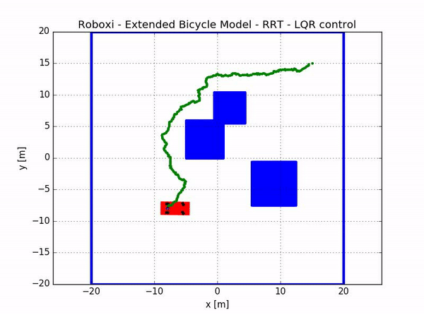
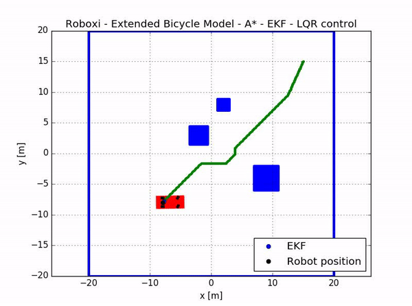

# Roboxi (Robotics Toolbox) Project
This Robotics Toolbox offers an easy to plug robotics algorithms into a simulation environment. The main idea create a modular simulation environment for robotics systems, in which several algorithms can be simple used.
We plan to cover the main areas in robotics such as perception, localization, mapping and motion planning. Any feedback is welcome =D! Notice this is a personal project and the main objective is to improve my robotics knowledge and programming skills =D

## Examples
This section presents some examples of the algorithms and combinations implemented in the Roboxi. Altough there are some limitations as path planning post smoothing. A look ahead algorithm is used to smooth out the final robot path. Furthermore, one may notice the lack of state of the art methods, but initially the main idea is to show the flexibility of how the toolbox can be used. Later we will introduce novel algorithms and methods...

* A* planner example

* RRT planner example

* Path planning with A* and inflated obstacles, controled using a pose controller

* Path planning with A* and inflated obstacles, controled using a LQR controller

* Differential Drive with A* planner, inflated obstacles and pose controller

* Differential Drive with RRT planner and LQR controller

* Extended Bicycle Modelwith RRT planner and LQR controller

* Extended Bicycle Model with A* planner, Extended Kalman Filter and LQR controller

* Front Wheel Drive with A* planner, Extended Kalman Filter and pose controller

## Models
The following models are currently available for the simulation:
* Simple car/bicycle model
* Differential Drive
* Extended Bicycle Kinematic model
* Front wheel drive
* Bicycle Dynamic model (todo)
* ...

## Solvers
The following solvers are currently available for the simulation:
* Euler solver
* Runge Kutta 4th Order
* ...

## Map
For now, simple grid map can be created with squared obstacles.
* Circular static obstacles (todo)
* Dynamical obstacles (todo)
* ...

## Localization/Maping
Currently no filters or localization algorithms are implemented. Ideas:
* Kalman Filter
* Particle Filter (todo)
* SLAM (todo)
* ...

## Planners
To find a path from the initial pose to the goal pose its possible to use a planning algorithm. The following planners are implemented:
* A* Planner (todo: heuristic that includes obstacles?)
* RRT
* RRT* 
* PRM (todo)
* ...

## Controllers
For each model one or more controllers can be used. A manual control mode is also provided.
* Simple car/bicycle model
	* Simple pose controller
	* Linear Quadratic Regulator
* Differential Drive 
	* Simple pose controller 
	* Linear Quadratic Regulator
* Extended Bicycle Kinematic model 
	* Simple pose controller 
	* Linear Quadratic Regulator
* Front wheel drive 
	* Simple pose controller 
	* Linear Quadratic Regulator (Todo)
* Manual Controller
    * Control the robot with the keyboard arrows
* MPC and IT-MPC (todos for any model)
* ...

## Further Ideas
Additional ideas for the future, when all basic part are implemented
* Prediction of dynamical obstacles
* Behaviour planning
* Reiforcement Learning
* GUI
* Pygame???
* ...

## Requirements

* Python 3.6
* numpy
* matplotlib

### Next todos
* collision check function
* argument parser
* documentation on how to use
* spline
* sensor class?
* graph slam
* round obstacles
* code cleaning/comments
* RRT, RRT* plot final path and correct collision check
